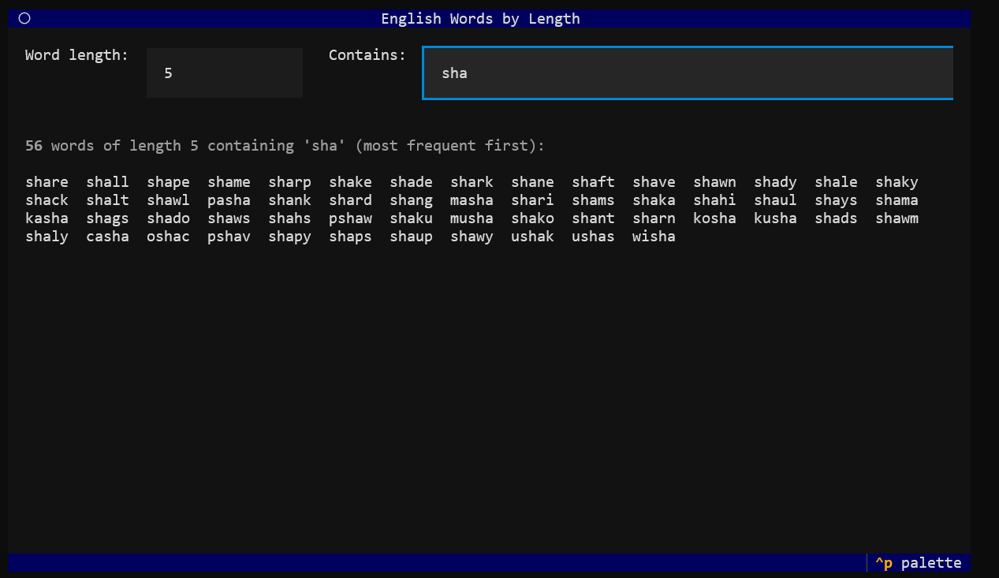

# helpish

A terminal app that lists every English word of a given length — handy for writing [Pilish](https://en.wikipedia.org/wiki/Pilish), where each word's length encodes a digit of π.



## Usage

Run it without installing using [uvx](https://docs.astral.sh/uv/):

```bash
uvx helpish
```

Or install from PyPI and run the `helpish` command:

```bash
pip install helpish
helpish
```

Run it directly from a checkout with uv:

```bash
uv run helpish
```

- Enter a number to see all words of that length.
- Use the **Contains** field to filter by substring.
- Results are sorted by frequency (most common first).
- Press `Ctrl+C` to quit.

Words come from `words_alpha.txt`, a comprehensive list that includes inflected forms (plurals, conjugations, comparatives), not just dictionary head-words.
